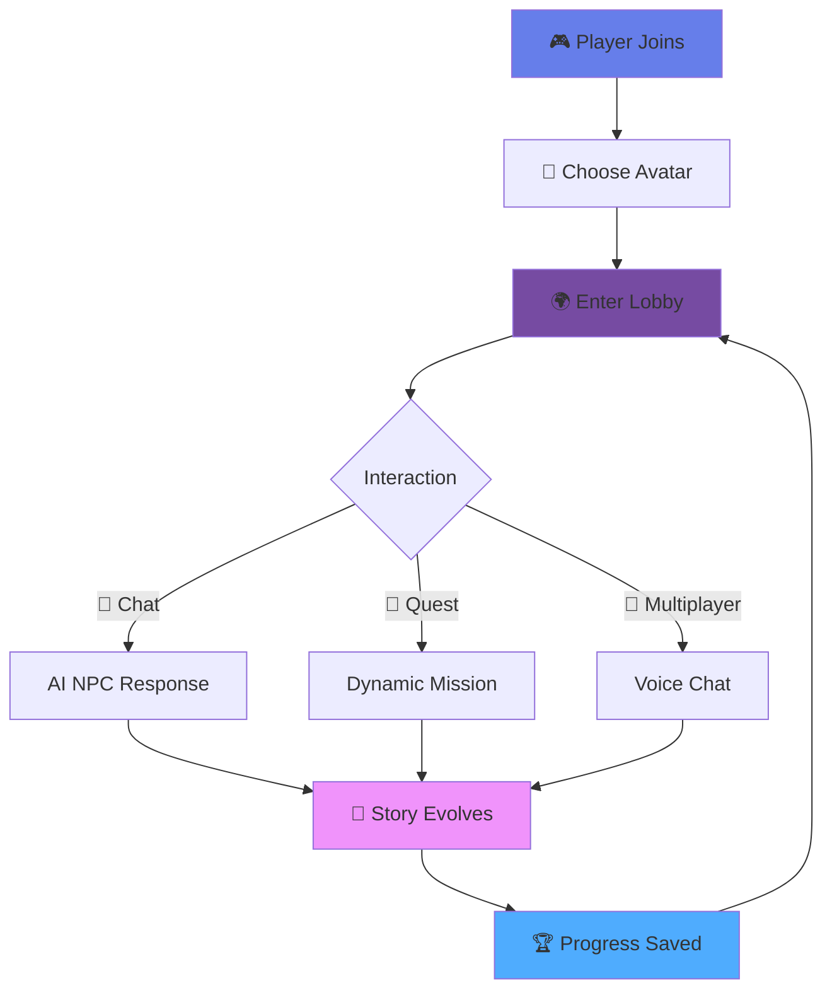
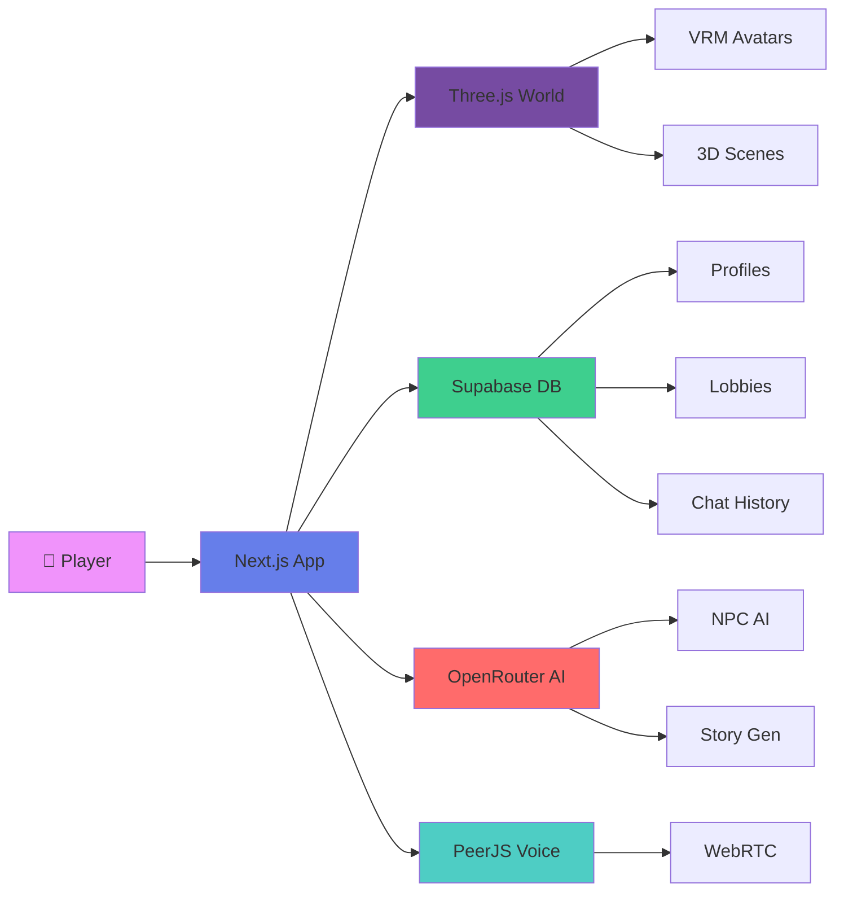

# YNGO - 3D Virtual Event Platform

A revolutionary 3D virtual event platform that creates immersive digital twin experiences for attendees. Assemble transforms virtual events from passive viewing experiences into interactive networking environments where meaningful connections happen naturally through spatial proximity and AI-enhanced conversations.



## 🎯 Core Features

<table>
<tr>
<td width="50%">

### 🌍 **Immersive 3D World**
Built with Three.js for stunning graphics that run smoothly in your browser. No downloads, no installations—just pure adventure.

### 🤖 **AI-Powered NPCs**
Every character remembers your conversations, reacts to your choices, and has their own personality powered by OpenRouter AI.

### 🎭 **Dynamic Storytelling**
Stories branch based on your decisions. AI-generated plot twists ensure no two playthroughs are identical.

</td>
<td width="50%">

### 👥 **Real-Time Multiplayer**
Create custom lobbies, invite friends, and adventure together with spatial voice chat powered by PeerJS.

### 🎨 **21 Unique Avatars**
From warriors to wizards, choose from diverse VRM characters with smooth animations and expressive gestures.

### 💾 **Cloud Saves**
Your progress, choices, and relationships persist across sessions with Supabase real-time sync.

</td>
</tr>
</table>

---

## 🎨 Character Gallery

<div align="center">

### **Meet Your Companions**

<table>
<tr>
<td align="center" width="20%">
<br/>
<b>Ayato</b><br/>
<sub>Noble Strategist</sub>
</td>
<td align="center" width="20%">
<br/>
<b>Beidou</b><br/>
<sub>Pirate Captain</sub>
</td>
<td align="center" width="20%">
<br/>
<b>Eula</b><br/>
<sub>Ice Warrior</sub>
</td>
<td align="center" width="20%">
<br/>
<b>Kazuha</b><br/>
<sub>Wandering Samurai</sub>
</td>
<td align="center" width="20%">
<br/>
<b>Raiden</b><br/>
<sub>Electro Archon</sub>
</td>
</tr>
</table>

**+ 16 More Diverse Characters:** Aisha, Alejandro, Alexander, Amir, Diego, Englando, Giulia, Haejin, Isabella, Jamal, Jing, Lin, Linn, Malik, Marisol, Yasmin

*Each character features unique VRM models with expressive animations and fluid movements*

</div>

---

## 🛠️ Technology Stack

<div align="center">

| Layer | Technology | Purpose |
|:---:|:---:|:---:|
| **Frontend** | Next.js 15.0.3 + React 19 | Server-side rendering & routing |
| **3D Engine** | Three.js 0.170.0 | Stunning 3D graphics & physics |
| **Avatars** | @pixiv/three-vrm 3.1.6 | VRM character models |
| **AI Brain** | OpenRouter API (Gemini Flash 1.5) | Dynamic NPC conversations |
| **Database** | Supabase PostgreSQL | Real-time data & auth |
| **Voice** | PeerJS 1.5.5 | WebRTC voice chat |
| **State** | Zustand 5.0.7 | Lightweight state management |
| **Styling** | Tailwind CSS | Beautiful UI components |

</div>

---

## 🚀 Quick Start

<details open>
<summary><b>📦 Installation</b></summary>

### Prerequisites
```bash
# Required
Node.js 18+
npm / yarn / pnpm / bun
```

### Setup Steps

**1️⃣ Clone & Install**
```bash
git clone https://github.com/yourusername/plottwist-rpg.git
cd plottwist-rpg
npm install --legacy-peer-deps
```

**2️⃣ Configure Environment**
```bash
# Create .env.local with:
NEXT_PUBLIC_SUPABASE_URL=your_supabase_project_url
NEXT_PUBLIC_SUPABASE_ANON_KEY=your_supabase_anon_key
OPENROUTER_API_KEY=your_openrouter_api_key
SERP_API_KEY=your_serp_api_key (optional)
ALCHEMY_API_KEY=your_alchemy_api_key (optional)
```

**3️⃣ Setup Database**
```bash
# Execute sql/FIX_REALTIME_COMPLETE.sql in your Supabase SQL Editor
# Or run:
node scripts/check-realtime-status.mjs
```

**4️⃣ Launch**
```bash
npm run dev
# Open http://localhost:3000
```

</details>

<details>
<summary><b>🎮 How to Play</b></summary>

1. **Create Profile** - Choose your username and avatar
2. **Join/Create Lobby** - Use 6-character code or create custom room
3. **Explore World** - WASD to move, mouse to look around
4. **Chat with NPCs** - Press Enter to open chat, type to interact
5. **Voice Chat** - Automatic spatial audio with nearby players
6. **Complete Quests** - AI generates dynamic missions based on your actions

</details>

## 🏗️ Architecture



## 📂 Project Structure

```
plottwist-rpg/
├── 🎨 app/
│   ├── components/
│   │   ├── world.tsx              # 3D scene renderer
│   │   ├── npc.tsx                # AI-powered NPCs
│   │   ├── model-viewer.tsx       # Avatar viewer
│   │   ├── RoomChat.tsx           # Real-time chat
│   │   ├── PeerJSVoiceChat.tsx    # Voice communication
│   │   └── LobbySelector.tsx      # Room management
│   ├── api/
│   │   ├── chat/route.js          # AI chat endpoint
│   │   └── google-search/route.js # Web search integration
│   └── [roomCode]/page.tsx        # Dynamic lobby pages
│
├── 🗄️ lib/
│   ├── lobbyStore.ts              # Zustand state
│   ├── supabase.ts                # Database client
│   ├── avatarAI.ts                # NPC personality
│   └── types.ts                   # TypeScript definitions
│
├── 🎭 public/
│   ├── avatars/                   # 21 VRM characters
│   ├── avatar-previews/           # Preview images
│   ├── animations/                # Mixamo animations
│   └── context/                   # Game assets metadata
│
└── 🗃️ sql/
    └── FIX_REALTIME_COMPLETE.sql  # Database schema
```

## 🎯 Key Features Deep Dive

### 🤖 AI-Powered NPCs
```typescript
// NPCs remember context across conversations
const npcMemory = {
  previousTopics: ["quest", "dragon", "treasure"],
  playerRelationship: "friendly",
  personality: "brave_warrior",
  emotionalState: "excited"
}
```
- **Persistent Memory**: NPCs remember your past conversations
- **Dynamic Responses**: Powered by Google Gemini Flash 1.5
- **Personality System**: Each NPC has unique traits and motivations
- **Emotional Intelligence**: Responds to player sentiment and context

### 🌍 Real-Time Multiplayer
```typescript
// Spatial voice chat with proximity detection
if (distance < VOICE_CHAT_RANGE) {
  enableVoiceChat(nearbyPlayer);
  adjustVolume(distance); // Closer = louder
}
```
- **PeerJS WebRTC**: Low-latency voice communication
- **Spatial Audio**: Volume adjusts based on player proximity
- **Room System**: Custom 6-character lobby codes
- **Live Sync**: Supabase real-time for instant updates

### 🎨 VRM Avatar System
- **21 Unique Characters** with distinct personalities
- **Mixamo Animations**: Idle, walk, run, gesture animations
- **Smooth Transitions**: Tween.js for fluid movements
- **Cross-Platform**: Works on desktop, mobile, VR-ready

---

## 🔧 Development Guide

<details>
<summary><b>🛠️ Adding New Characters</b></summary>

1. Place VRM file in `public/avatars/`
2. Add preview image to `public/avatar-previews/`
3. Update `lobbyConfig.ts`:
```typescript
{
  id: 'newchar',
  name: 'New Character',
  modelPath: '/avatars/newchar.vrm',
  previewImage: '/avatar-previews/newchar.webp'
}
```

</details>

<details>
<summary><b>🎭 Customizing NPC Personalities</b></summary>

Edit `lib/avatarAI.ts`:
```typescript
const personality = {
  name: "Wise Sage",
  traits: ["knowledgeable", "patient", "mysterious"],
  greeting: "Greetings, traveler...",
  knowledge: ["ancient_magic", "quest_lore"],
  conversationStyle: "philosophical"
}
```

</details>

<details>
<summary><b>🌐 Deploying to Production</b></summary>

**Vercel Deployment**
```bash
vercel --prod
```

**Environment Variables Required:**
- `NEXT_PUBLIC_SUPABASE_URL`
- `NEXT_PUBLIC_SUPABASE_ANON_KEY`
- `OPENROUTER_API_KEY`

**Database Setup:**
1. Create Supabase project
2. Run `sql/FIX_REALTIME_COMPLETE.sql`
3. Enable Realtime for: `profiles`, `avatar_states`, `room_messages`

</details>

---

## 🤝 Contributing

We welcome contributions! Here's how:

1. 🍴 Fork the repository
2. 🌱 Create feature branch: `git checkout -b feature/AmazingFeature`
3. 💾 Commit changes: `git commit -m 'Add AmazingFeature'`
4. 📤 Push to branch: `git push origin feature/AmazingFeature`
5. 🎉 Open Pull Request

**Areas We Need Help:**
- 🎨 New VRM character models
- 🗺️ Additional 3D environments
- 🤖 Enhanced AI conversation logic
- 🌐 Localization (i18n)
- 📱 Mobile optimization

---

## 📊 Performance Stats

<div align="center">

| Metric | Value |
|:---:|:---:|
| Initial Load | ~2.5s |
| First Contentful Paint | ~1.2s |
| VRM Load Time | ~800ms |
| FPS (Desktop) | 60+ |
| FPS (Mobile) | 30+ |
| WebRTC Latency | <100ms |

</div>

---

## 🐛 Troubleshooting

<details>
<summary><b>❌ Chat subscription failing</b></summary>

Run SQL fix:
```bash
# Execute sql/FIX_REPLICA_IDENTITY.sql
# Or enable Realtime in Supabase Dashboard:
# Database > Replication > Toggle room_messages
```

</details>

<details>
<summary><b>🎮 Avatar not loading</b></summary>

Check console for:
- VRM file path correctness
- Three.js version compatibility
- Browser WebGL support: `chrome://gpu`

</details>

<details>
<summary><b>🔊 Voice chat not working</b></summary>

1. Check microphone permissions
2. Ensure HTTPS (PeerJS requires secure context)
3. Verify PeerJS connection in Network tab
4. Try different STUN/TURN servers

</details>

---

## 📄 License

MIT License - See [LICENSE](LICENSE) for details

---

## 🙏 Acknowledgments

- **Three.js** - 3D rendering engine
- **@pixiv/three-vrm** - VRM avatar support
- **Supabase** - Real-time database & auth
- **OpenRouter** - AI model aggregation
- **Mixamo** - Character animations
- **Vercel** - Hosting platform

---

---

**Transforming virtual events from passive to interactive - Built with ❤️ for meaningful human connection**
